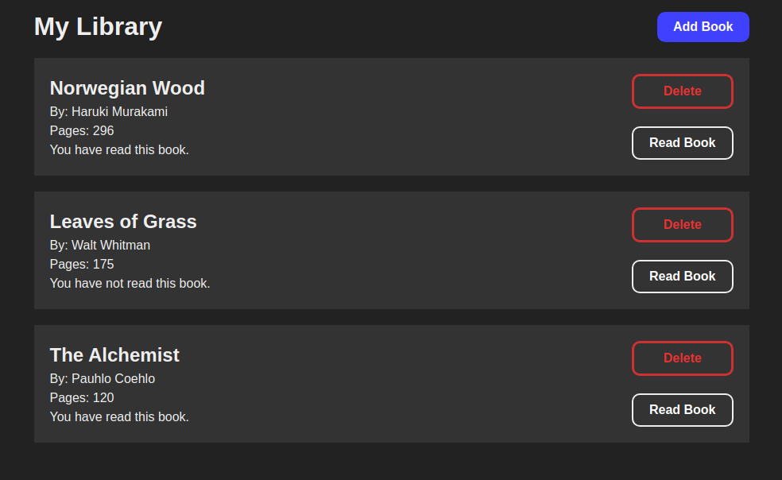

# Library App

This basic library tracking application implements basic CRUD functionality.

Users can add, delete, and modify the details of the books in their library.

This project was created as part of The Odin Project curriculum in the Javascript course.

Persistent storage is not implemented as this was not required for the assignment. See my more recent projects for implementations of persistent data across sessions.

# Screenshot

Here's what it looks like filled in with some dummy data.

The form to add an entry appears upon clicking the 'Add Book' button.

